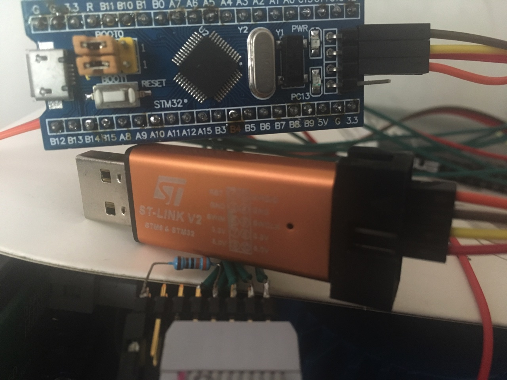

#原理图

测试一下ES9038工作在sync模式下的声音表现

###DAC接口

|  管脚  |  功能  |
| :-----: | :------: |
|1/3      |  5V      |
|4        |  RESETB  |
|5/7      |  GND     |
|8        |  SDA     |
|9        |  MCLK    |
|10       |  SCL     |

###I2S接口

|  管脚  |  功能  |
| :-----: | :------: |
|1        |  LRCLK   |
|2        |  BCLK    |
|3        |  DATA    |
|5        |  GND     |

###Amanero USB界面接口

请参考 https://www.amanero.com/drivers/combo384-D.pdf

#硬件

STM32F103C8T6最小系统板   X1

ST-LINK V2 下载器        X1

USB2UART 转接线          X1

##下载固件

[测试固件 V1](./fw/dacc-v1.bin)

###Windows

请参考ST-LINK V2使用手册。

###Linux

Ubuntu下可从软件仓库里面搜索到安装包，下载安装即可。
或者，按照 https://github.com/texane/stlink 说明，自行编译安装。

###Mac

brew install stlink
